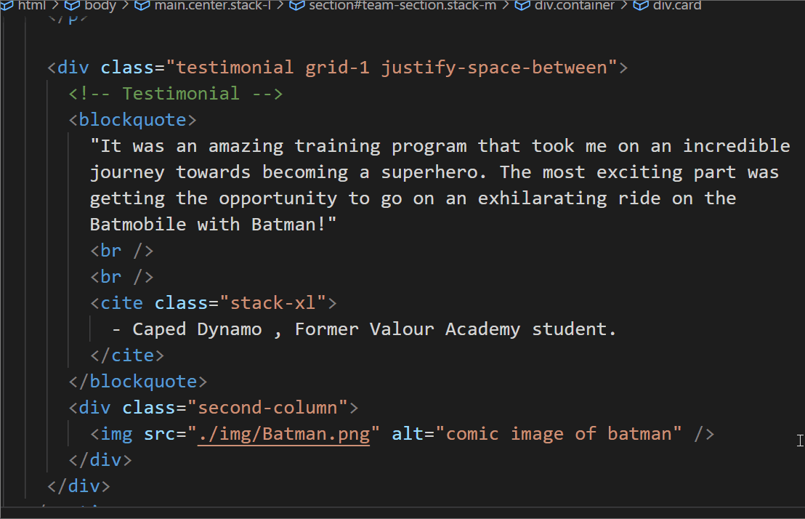
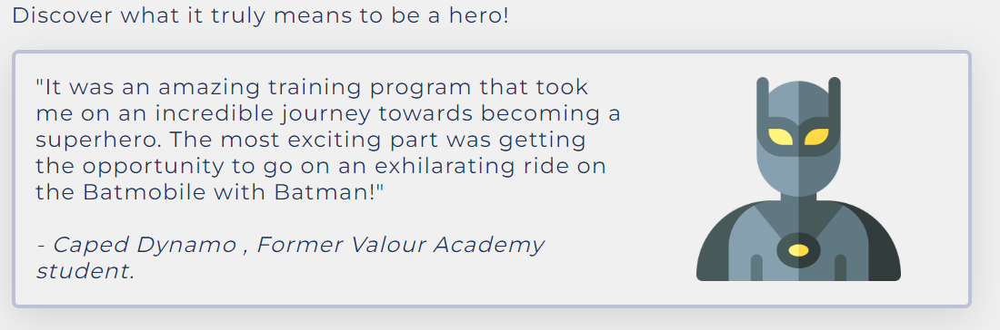
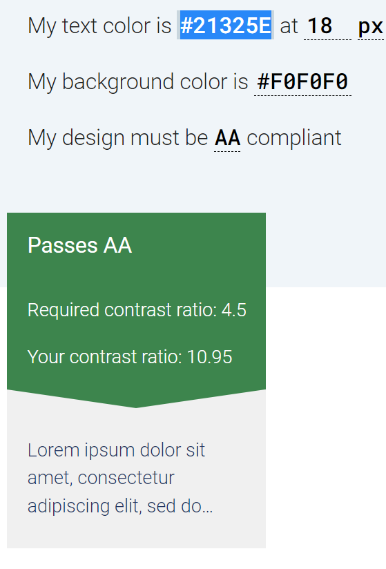
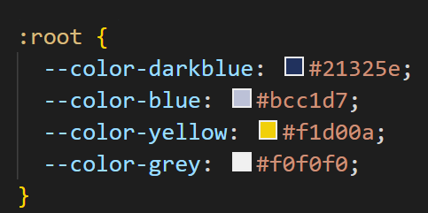
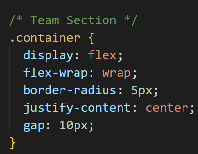
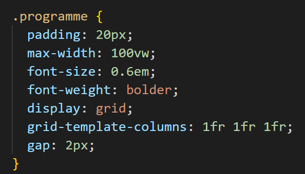
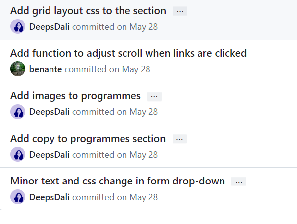

# Markup portfolio

**Aim:** Learn how to make web pages—accessible, to use semantic HTML, and well-organised CSS.

**Project:** Valour Academy agency website is designed to promote and provide information about Valour Academy, a training program for real-life superheroes. The website has a responsive design and it showcases the academy's mission, team of trainers, training programs, and allows users to get in touch through a contact form.

https://benante.github.io/agency-website/

# Learnings

## 1. Structure a site using semantic HTML to aid accessibility



Incorporated semantic elements like `<header>`, `<nav>`, `<main>`, ` <footer>`,`<blockquote>` etc throughout the website. Alt-tags are also included on all the images. See sample code above.

## 2. Ensure a web page is readable for screen readers

ARIA labels used throughout the site so assistive technologies can provide more meaningful information to users with disabilities, making the website more accessible and usable for everyone. Sections were made focusable with the tabindex attribute to improve keyboard accessibility.

```
<div class="card" tabindex="0" role="button" aria-pressed="false" aria-describedby="caption1">
```

For example this code represents a card element that can be interacted with like a button. The role="button" attribute assigns a button role to the element, and the aria-pressed="false" attribute indicates the initial state of the button (not pressed). The aria-describedby attribute refers to the caption associated with the card.

## 3. Ensure our UI has sufficient colour contrast so that everyone can perceive it comfortably

To ensure that UI has adequate color contrast, utilized color contrast checking tools to verify that the foreground and background colors comply with the WCAG (Web Content Accessibility Guidelines) standards. This approach ensures that all users can comfortably perceive and read the content.



<!--  -->

## 4. Use various tools to check that our website meets accessibility criteria

Used [Lighthouse](https://developer.chrome.com/docs/lighthouse/overview/) in Chrome DevTools to check if website meets accessibility criteria

## 5. Use CSS media queries to ensure our content is always presented effectively on screens of different sizes

```
@media (max-width: 768px) {
  .container {
    flex-direction: column;
    gap: 0.5em;
  }
  .card {
    width: auto;
  }
}
```

## 6. Demonstrate a mobile-first approach to building a website


## 7. Use CSS variables to apply repeated colours to HTML elements



## 8. Use CSS Flexbox to style children in a single-direction layout (ie a row or a column)

Flexbox used in Teams section



## 9. Use CSS Grid to style children in two-direction layout

Grid layout used in Programmes section



## 10. Ensure our Git commit history tells a coherent story



## 11. Use the appropriate input types in HTML forms for gathering different types of information

Used appropriate input types in contact form

```
            <input
              type="text"
              id="name"
              name="name"
              placeholder="e.g Peter Parker"
              required
              aria-required="true"
            />

            <input
              type="email"
              id="email"
              name="email"
              placeholder="e.g peter_parker@vigilante.com"
              required
              aria-required="true"
            />

            <input
              id="tel"
              name="tel"
              type="tel"
              placeholder="012345678"
              required
              minlength="8"
              aria-required="true"
            />
            <input type="checkbox" name="subscription" id="checkbox" />

```
