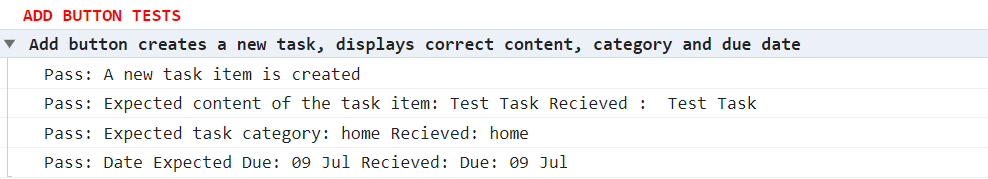
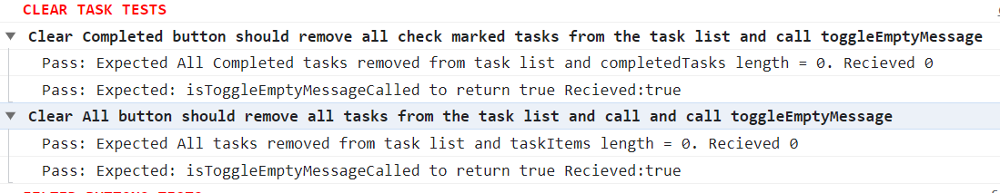

# Testing portfolio

## 1. Check that passing a given input into our tests returns the expected output

Used test helper functions to compare expected results with the actual results.

```
const equal = (actual, expected, message) => {
  if (actual === expected) {
    const defaultMessage = `Expected ${expected} and recieved ${actual}`;
    console.info(`Pass: ` + (message || defaultMessage));
  } else {
    const defaultMessage = `Expected ${expected} but recieved ${actual} instead`;
    console.error(`Fail: ` + (message || defaultMessage));
  }
};
```





## 2. Write tests to mimic the behaviour of a user performing different actions

```

  test("Clear Completed button should remove all check marked tasks from the task list and call toggleEmptyMessage", () => {
    clearCompletedTasks();
    const completedTasks = document.querySelectorAll(
      ".task-item input[type='checkbox']:checked"
    );

    equal(
      completedTasks.length,
      0,
      `Expected All Completed tasks removed from task list and completedTasks length = 0. Recieved ${completedTasks.length}`
    );
    equal(
      isToggleEmptyMessageCalled,
      true,
      `Expected: isToggleEmptyMessageCalled to return true Recieved:${isToggleEmptyMessageCalled}`
    );
  });


```

The test verifies that the "Clear Completed" button correctly removes all checked tasks from the task list, and the toggleEmptyMessage function is called. The test uses the equal function to check expected results against actual outcomes, making sure the tasks are cleared and the empty message display is appropriately handled.

## 3. Write testable, modular functions

All functions have a very specific functionalty so they have corresponding tests.

For example the addTask function adds a new task item to the task list on the webpage. It takes input values, creates DOM elements (checkbox, label, edit button, delete button), and appends them to the task list. This modular approach allows for easier testing and maintenance of the codebase.

It has a corresponding addTaskTest function. It simulates a form submission with specific input values (text, category, and date) to add a new task item. The test checks whether the task item is created correctly, including the content, category, and due date.

## 4. Write functions that add, remove or modify DOM nodes

There are functions to add, edit and remove a particular task.

From the list of tasks created, there are functions to filter tasks based on their category of Home or Work and also filter Pending or Completed Tasks.

There are also functions to completely clear the list of tasks or only the completed tasks from the list as shown below:

```
const removeChecked = () => {
  const taskList = document.querySelector("#task-list");
  const completedTasks = taskList.querySelectorAll(
    ".task-item input[type='checkbox']:checked"
  );

  completedTasks.forEach((task) => {
    const taskItem = task.parentNode;
    taskList.removeChild(taskItem);
  });

  toggleEmptyMessage();
};
```

## 5. Apply event listeners to HTML form elements

The filterHandler function exports event handlers for respective buttons to filter task list.

```
export function filterHandler() {
    showAllBtn.addEventListener("click", e => {
        activeButtonFunc(e);
        showAllFunc();
    });

    showPendingBtn.addEventListener("click", e => {
        activeButtonFunc(e);
        filterTasksFunc(true);
    });

    showCompletedBtn.addEventListener("click", e => {
        activeButtonFunc(e);
        filterTasksFunc(false);
    });

    homeBtn.addEventListener("click", e => {
        filterByTaskType("work")
    })
    workBtn.addEventListener("click", e => {
        filterByTaskType("home")
    })
}
```

The code below foor form.addEventListener("submit", function (event) {...}) sets up an event listener to handle form submissions. When the form is submitted, the event listener function will be called. The function prevents the default form submission behavior, adds a new task item to the task list using the addTask function, and will also handle task removal, task editing, and task filtering using the corresponding functions (removeTask, editTask, and filterNewTasks)

```
form.addEventListener("submit", function (event) {
  event.preventDefault();
  addTask();
  removeTask();
  editTask();
  filterNewTasks();
});
```

## 6. Use scope to control what variables are accessible inside functions and blocks

Examples of different types of scopes used are:

1. Global Scope:

addTask function: This function is declared in the global scope as it is directly exported from the module. It can be accessed and executed from anywhere in the code.

2. Function Scope:

All the variables declared using const and let keywords inside the addTask function (e.g., taskList, inputValue, taskItem, checkbox, label, editButton, deleteButton, taskCategorySelect, selectedOption, dueDate, selectedDate, displayDate) have function scope and are accessible only within the addTask function.

3. Block Scope:

The selectedOption variable is declared using const inside a block (if statement) and has block scope limited to that block.

## 7. Use CSS grid to create complex layouts

In this project the layout is fairly simple so mostly CSS flexbox is used. Grid layout is used on edit functionality in desktop layout.

## 8. Use CSS grid to make layouts that adapt to the viewport size

Website created with mobile first design layout. The grid template area property is used in media queries for desktop layout.

```
@media screen and (min-width: 760px) {
    .edit-task {
      width: 680px;
      display: grid;
      grid-template-areas:
      "textInput dateInput"
      "textInput typeInput";
      grid-template-columns: 3fr 1fr;
      column-gap: 20px;
      row-gap: 20px;
    }
    .edit-text-input {
      width: 100%;
      align-self: center;
    }
  }
```
